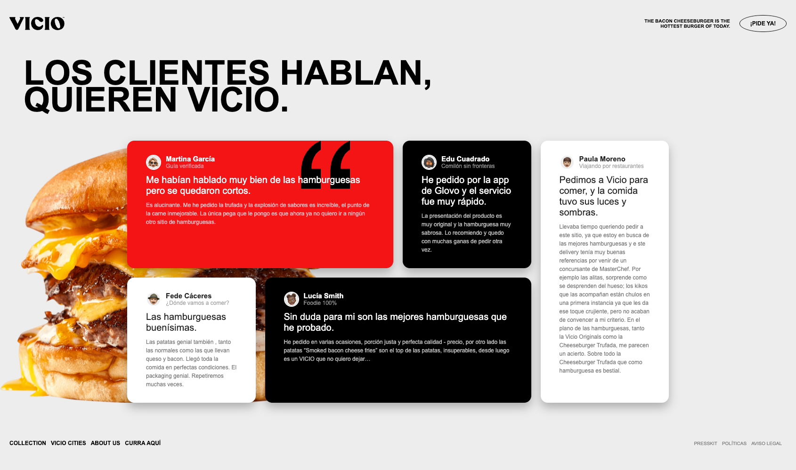

¡Se me ha abierto el apetito!

Ya conocemos un montón de conceptos de css y es momento de aplicarlos, la idea, montar una landing de opiniones sobre las hamburguesas Vicio:

Requisitos:

- Utilizar flex y grid para la estructuración de la página
- Nomenclatura BEM para asentar los conocimientos que hemos adquirido sobre naming
- SCSS, tenemos que usar todo el potencial que nos da ( variables, mixins …)
- Para rematar, habrá que crear un repositorio y compartirlo con git pages

Os dejamos los assets necesarios y los diseños:

> [Recursos](recursos/assets.zip)

> [Diseños](recursos/disenos-vicio.zip)

> [Textos](recursos/textos.txt)

A nivel de diseño:

- La fuente es Arial, tendréis que revisar si se encuentra entre las fuentes compatibles con todos los navegadores para ver si hace falta o no importarla.
- Colores:
    - Negro: #000
    - Blanco: #FFF
    - Rojo: #F71414
    - Gris: gray
- Tendréis que investigar como montar unas sombras del estilo que se aplican a la tarjeta
- Los enlaces y botones tienen hover, ¿os atrevéis a aplicar alguna transición?
